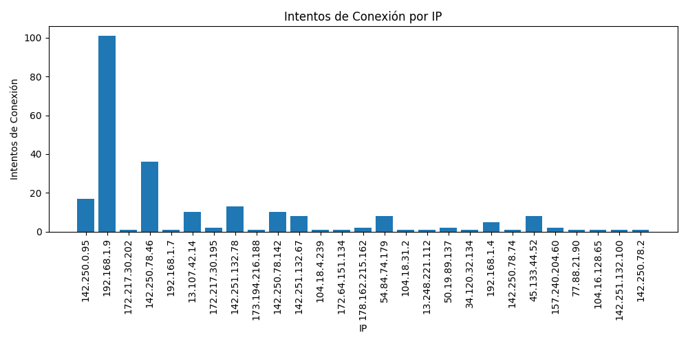

# Sistema de Monitoreo de Seguridad
Un sistema de monitoreo de seguridad mediante el uso de Wireshark el cual es procesado por Python para poder obtener reportes en Excel.

## Intentos Conexión por IP
Se obtiene la imagen la cual se generará en un archivo excel.csv

  

